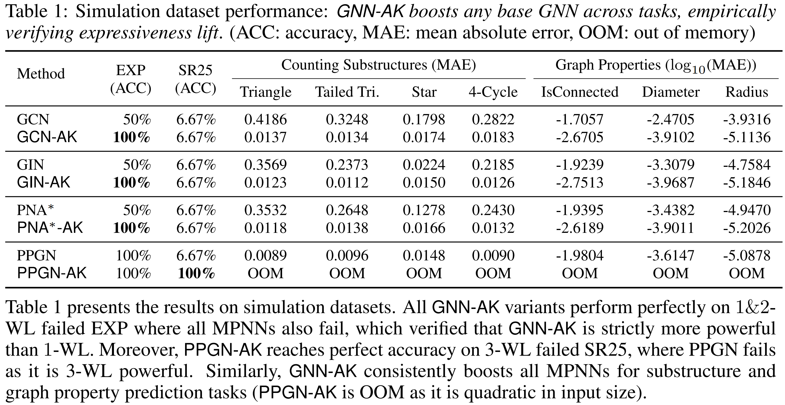
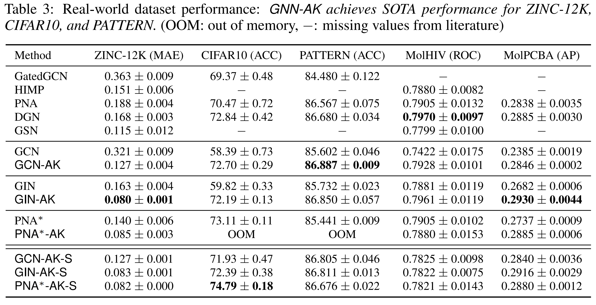

# GNNAsKernel
Official code for [**From Stars to Subgraphs: Uplifting Any GNN with Local Structure Awareness**](https://openreview.net/forum?id=Mspk_WYKoEH)

## Visualizations
### GNN-AK(+)

### GNN-AK(+) with SubgraphDrop 


## Setup 

```
# params
# 10/6/2021, newest packages. 
ENV=gnn_ak
CUDA=11.1
TORCH=1.9.1
PYG=2.0.1

# create env 
conda create --name $ENV python=3.9 -y
conda activate $ENV

# install pytorch 
conda install pytorch=$TORCH torchvision torchaudio cudatoolkit=$cuda -c pytorch -c nvidia -y

# install pyg2.0
conda install pyg=$PYG -c pyg -c conda-forge -y

# install ogb 
pip install ogb

# install rdkit
conda install -c conda-forge rdkit -y

# update yacs and tensorboard
pip install yacs==0.1.8 --force  # PyG currently use 0.1.6 which doesn't support None argument. 
pip install tensorboard
pip install matplotlib

```

## Code structure
``core/`` contains all source code.   
``train/`` contains all scripts for available datasets.  

* Subgraph extraction is implemented as data transform operator in PyG. See ``core/transform.py``. The transform layer will built the mapping from original nodes and edges to all subgraphs.  
* The mappings are used directly in ``GNN-AK(+)`` to online build the combined subgraphs for each graph, see ``core/model.py``. (For each graph with N node, N subgraphs are combined to a gaint subgraph first. Then for batch, all combined gaint subgraphs are combined again.) 
* SubgraphDrop is implemented inside ``core/transform.py``, see [here]( https://github.com/GNNAsKernel/GNNAsKernel/blob/f642cd1c8b4f9ef5005f24a4a36b2e8c2147b36a/core/transform.py#L62). And the [usage](https://github.com/GNNAsKernel/GNNAsKernel/blob/f88861ec32d211f0392cae2c782ad9950aeaa601/core/model.py#L128) in ``core/model.py``. 
* ``core/model_utils/pyg_gnn_wrapper.py`` is the place to add your self-designed GNN layer X and then use X-AK(+) on fly~


## Hyperparameters 

See ``core/config.py`` for all options. 

## Run normal GNNs 

See ``core/model_utls/pyg_gnn_wrapper.py`` for more options.   

Custom new GNN convolutional layer 'X' can be plugged in ``core/model_utls/pyg_gnn_wrapper.py``, and use 'X' as model.gnn_type option. 

```
# Run different normal GNNs 
python -m train.zinc model.mini_layers 0 model.gnn_type GINEConv
python -m train.zinc model.mini_layers 0 model.gnn_type SimplifiedPNAConv
python -m train.zinc model.mini_layers 0 model.gnn_type GCNConv
python -m train.zinc model.mini_layers 0 model.gnn_type GATConv
python -m train.zinc model.mini_layers 0 model.gnn_type ...

python -m train.zinc model.num_layers 6 model.mini_layers 0 model.gnn_type GCNConv # 6-layer GCN
```
## Run different datasets
See all available datasets under train folder.

``` 
# Run different datasets
python -m train.zinc 
python -m train.cifar10 
python -m train.counting 
python -m train.graph_property 
python -m ...
```

## Run GNN-AK 

Fully theoretically explained by Subgraph-1-WL*. 

Use:    ``model.mini_layers 1 (or >1) model.embs "(0,1)" model.hops_dim 0 ``

```
python -m train.zinc model.mini_layers 1 model.gnn_type GINEConv model.embs "(0,1)" model.hops_dim 0  
```

## Run GNN-AK+

At least as powerful as GNN-AK (or more powerful).

Use:    ``model.mini_layers 1 (or >1) model.embs "(0,1,2)" model.hops_dim 16 ``   
These are set as default. See ``core/config.py``.

```
# Run GNN-AK+ with different normal GNNs
python -m train.zinc model.mini_layers 1 model.gnn_type GINEConv            # 1-layer base model
python -m train.zinc model.mini_layers 1 model.gnn_type SimplifiedPNAConv   # 1-layer base model
python -m train.zinc model.mini_layers 2 model.gnn_type GINEConv            # 2-layer base model
python -m train.zinc model.mini_layers 2 model.gnn_type SimplifiedPNAConv   # 2-layer base model
```
## Run with different number of GNN-AK(+) iterations 
Changing number of outer layers.
```
python -m train.zinc model.num_layers 4 
python -m train.zinc model.num_layers 6 
python -m train.zinc model.num_layers 8 
```

## Run with different subgraph patterns 
See ``core/transform.py`` for detailed implementation.

```
python -m train.zinc subgraph.hops 2      # 2-hop egonet
python -m train.zinc subgraph.hops 3      # 3-hop egonet

# Run with random-walk subgraphs based on node2vec 
python -m train.zinc subgraph.hops 0 subgraph.walk_length 10 subgraph.walk_p 1.0 subgraph.walk_q 1.0  
```

## Run GNN-AK(+) with SubgraphDrop

See option ``sampling`` section under ``core/config.py``.

Change ``sampling.redundancy``(R in the paper) to change the resource usage.
```
python -m train.zinc sampling.mode shortest_path sampling.redundancy 1 sampling.stride 5 sampling.batch_factor 4
python -m train.zinc sampling.mode shortest_path sampling.redundancy 3 sampling.stride 5 sampling.batch_factor 4
python -m train.zinc sampling.mode shortest_path sampling.redundancy 5 sampling.stride 5 sampling.batch_factor 4


python -m train.cifar10 sampling.mode random sampling.redundancy 1 sampling.random_rate 0.07 sampling.batch_factor 8 
python -m train.cifar10 sampling.mode random sampling.redundancy 3 sampling.random_rate 0.21 sampling.batch_factor 8 
python -m train.cifar10 sampling.mode random sampling.redundancy 5 sampling.random_rate 0.35 sampling.batch_factor 8 
## Note: sampling.random_rate = 0.07*sampling.redundancy. 0.07 is set based on dataset. 
```


## Results 
### GNN-AK boosts expressiveness

### GNN-AK boosts practical performance



## Cite
Please cite our work if you use our code!

```
@inproceedings{
    zhao2022from,
    title={From Stars to Subgraphs: Uplifting Any {GNN} with Local Structure Awareness},
    author={Lingxiao Zhao and Wei Jin and Leman Akoglu and Neil Shah},
    booktitle={International Conference on Learning Representations},
    year={2022},
    url={https://openreview.net/forum?id=Mspk_WYKoEH}
}
```


<!--
**GNNAsKernel/GNNAsKernel** is a ✨ _special_ ✨ repository because its `README.md` (this file) appears on your GitHub profile.

Here are some ideas to get you started:

- 🔭 I’m currently working on ...
- 🌱 I’m currently learning ...
- 👯 I’m looking to collaborate on ...
- 🤔 I’m looking for help with ...
- 💬 Ask me about ...
- 📫 How to reach me: ...
- 😄 Pronouns: ...
- ⚡ Fun fact: ...
-->
